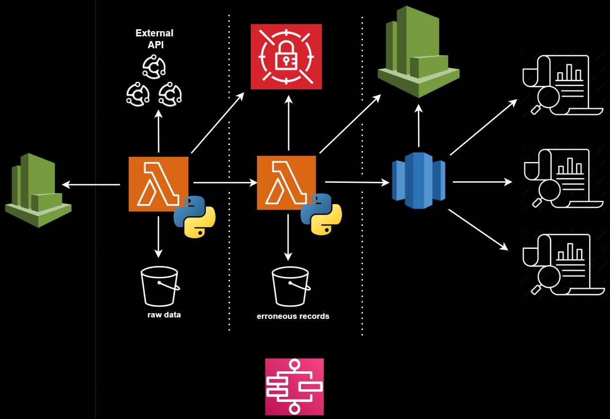

<div align="center">
    <h1>Volka Games - Senior Data Engineer Test</h1>
</div>


<div align="center">
    
</div>

##
This repository extract, process, and loads data related to marketing campaigns and their corresponding ads. It includes functionality for fetching API keys, extracting and processing data from a thrid-party API, and loading it into a postgres database for downstream analysis.

## Project Structure

```
volka_games_test/
├── extract_process_load.py     # Main script to extract, process, and load data
├── requirements.txt            # Python dependencies
├── schema.sql                  # SQL schema for database tables
├── configs/                    
│   ├── api.py                  # API-related configurations
├── etl/                        
│   ├── extract_data.py         # Handles data extraction from APIs
│   ├── load_data.py            # Handles database interactions
│   ├── process_data.py         # Processes extracted data into database-ready format
```

## Prerequisites

- Python 3.11 or higher
- PostgreSQL database

## Setup

1. **Clone the Repository**:
   ```bash
   git clone https://github.com/thedataninja1786/volka-games-assessment.git
   cd volka_games_test
   ```

2. **Set Up Virtual Environment**:
   ```bash
   python -m venv volka_games_test
   source volka_games_test/Scripts/activate  # On Windows
   ```

3. **Install Dependencies**:
   ```bash
   pip install -r requirements.txt
   ```

4. **Set Environment Variables**:
   Create a `.env` file in the root directory with the following variables:
   ```env
   secret_name=<your_secret_name>
   aws_access_key_id=<your_aws_access_key_id>
   aws_secret_access_key=<your_aws_secret_access_key>
   region_name=<your_aws_region>
   user=<your_db_user>
   password=<your_db_password>
   host=<your_db_host>
   port=<your_db_port>
   dbname=<your_db_name>
   ```


5. **Set Up Database**:
   Use the `schema.sql` file to create the required database tables in postgres

## Usage

### Command-Line Arguments

The `extract_process_load.py` script utilizes the `argparse` library to allow passing parameters through the console. This makes it flexible to specify parameters like the source date and window size dynamically.

### Example Usage:
```bash
python extract_process_load.py --source_date 2025-05-01 --window 7 --shift 0
```

### Arguments:
- `--source_date`: The starting date for the data extraction in `YYYY-MM-DD` format.
- `--window`: The number of days to include in the date range window.
- `--shift`: The number of days to shift from the source date.

## File Descriptions

- **`etl/extract_data.py`**:
  Handles data extraction from APIs based on specified parameters.

- **`etl/process_data.py`**:
  Processes the extracted data into a format suitable for database insertion.

- **`etl/load_data.py`**:
  Handles database interactions, including upserts and batch inserts.

- **`extract_process_load.py`**:
  Main entry point for the project. Orchestrates data extraction, processing, and loading.

- **`schema.sql`**:
  Contains the SQL schema for the required database tables.

## Troubleshooting

1. **Environment Variables Not Set**:
   Ensure all required environment variables are set in the `.env` file.

2. **Database Connection Issues**:
   Verify that the database is running and the connection parameters are correct.

3. **AWS Secrets Manager Errors**:
   Ensure your AWS credentials and permissions are correctly configured.

4. **Missing Dependencies**:
   Run `pip install -r requirements.txt` to install all required dependencies.

## AWS Architecure
<div align="center">
    
</div>